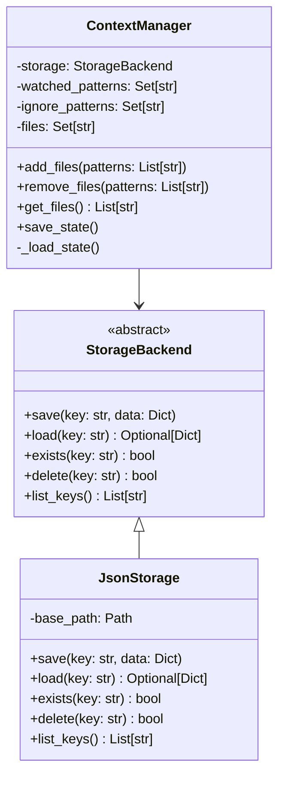

# contextr Architecture Document

## Table of Contents
1. [System Overview](#system-overview)
2. [Current Architecture](#current-architecture)
3. [Component Details](#component-details)
4. [Data Flow & State Management](#data-flow--state-management)
5. [Storage Architecture](#storage-architecture)
6. [Profile Architecture (Epic 2)](#profile-architecture-epic-2)
7. [Technical Decisions](#technical-decisions)
8. [Testing Architecture](#testing-architecture)
9. [Future Considerations](#future-considerations)

## System Overview

### System Context
```
┌─────────────────┐     ┌──────────────┐     ┌─────────────┐
│   Developer     │────▶│   contextr   │────▶│  Clipboard  │
│   (CLI User)    │     │     CLI      │     │   (LLM)     │
└─────────────────┘     └──────────────┘     └─────────────┘
         │                      │
         │                      ▼
         │              ┌──────────────┐
         └─────────────▶│  File System │
                        │  (.contextr) │
                        └──────────────┘
```

### High-Level Architecture
`contextr` is a monolithic CLI application built with:
- **Presentation Layer**: Typer CLI framework with Rich formatting
- **Business Logic Layer**: ContextManager for state management
- **Storage Layer**: Pluggable storage backend system
- **Utility Layer**: Path and pattern matching utilities

## Current Architecture

### Component Structure
```
src/contextr/
├── cli.py                 # Presentation Layer
│   ├── app: Typer        # CLI application instance
│   ├── watch()           # Add file patterns
│   ├── ignore()          # Add ignore patterns
│   ├── list()            # Display tracked files
│   ├── clear()           # Clear patterns
│   └── sync()            # Copy to clipboard
│
├── manager.py             # Business Logic Layer
│   └── ContextManager
│       ├── __init__(storage: Optional[StorageBackend])
│       ├── add_files()   # Add patterns
│       ├── remove_files()# Remove patterns
│       ├── get_files()   # List files
│       ├── save_state()  # Persist state
│       └── _load_state() # Load state
│
├── formatters.py          # Formatting Layer
│   └── format_files_as_xml()
│
├── storage/               # Storage Abstraction Layer
│   ├── base.py
│   │   └── StorageBackend (ABC)
│   │       ├── save()
│   │       ├── load()
│   │       ├── exists()
│   │       ├── delete()
│   │       └── list_keys()
│   └── json_storage.py
│       └── JsonStorage(StorageBackend)
│
└── utils/                 # Utility Layer
    ├── ignore_utils.py
    │   └── should_ignore()
    └── path_utils.py
        ├── find_git_root()
        └── get_relative_path()
```

### Class Diagram


## Component Details

### CLI Layer (`cli.py`)
- **Responsibility**: User interface and command routing
- **Framework**: Typer with Rich console output
- **Commands**: watch, ignore, list, clear, sync
- **Error Handling**: User-friendly messages with proper exit codes

### Business Logic Layer (`manager.py`)
- **Core Class**: `ContextManager`
- **State Management**: In-memory pattern sets
- **File Discovery**: Glob pattern matching with ignore filtering
- **Storage Integration**: Delegates persistence to storage backend
- **Key Features**:
  - Dependency injection for storage
  - Atomic state updates
  - Efficient file discovery

### Storage Layer (`storage/`)
- **Abstract Interface**: `StorageBackend` ABC
- **JSON Implementation**: `JsonStorage` with atomic writes
- **Key Features**:
  - Pluggable architecture for future backends
  - Atomic file operations prevent corruption
  - Hierarchical key support for profiles
  - Type-safe with full annotations

### Formatting Layer (`formatters.py`)
- **Purpose**: Format output for LLM consumption
- **Current Format**: XML with file metadata
- **Extensible**: Prepared for multiple format support

### Utility Layer (`utils/`)
- **Path Utilities**: Git root discovery, path normalization
- **Ignore Utilities**: Gitignore-style pattern matching
- **Type Safe**: Full type annotations with Pattern types

## Data Flow & State Management

### State Model
```json
{
  "files": ["src/file1.py", "src/file2.py"],
  "watched_patterns": ["src/**/*.py", "tests/**/*.py"],
  "ignore_patterns": ["**/__pycache__/**", "*.pyc"],
  "negation_patterns": []
}
```

### Command Flow
```
1. User Input (CLI)
   ↓
2. Command Handler (cli.py)
   ↓
3. ContextManager Operation
   ↓
4. State Update (in-memory)
   ↓
5. Storage Backend Save
   ↓
6. File System (.contextr/state.json)
```

### File Discovery Flow
```
1. Load Patterns from State
   ↓
2. Apply Watch Patterns (glob)
   ↓
3. Filter with Ignore Patterns
   ↓
4. Resolve Relative Paths
   ↓
5. Return Sorted File List
```

## Storage Architecture

### Design Principles
1. **Abstraction**: Backend-agnostic interface
2. **Atomic Operations**: Prevent data corruption
3. **Type Safety**: Full type annotations
4. **Extensibility**: Easy to add new backends

### Current Implementation
```python
# Storage Backend Interface
class StorageBackend(ABC):
    @abstractmethod
    def save(self, key: str, data: Dict[str, Any]) -> None:
        """Save data with given key"""
        
    @abstractmethod
    def load(self, key: str) -> Optional[Dict[str, Any]]:
        """Load data by key"""

# JSON Storage Implementation
class JsonStorage(StorageBackend):
    def save(self, key: str, data: Dict[str, Any]) -> None:
        # Atomic write with temp file
        temp_path = file_path.with_suffix('.tmp')
        temp_path.write_text(json.dumps(data, indent=2))
        temp_path.replace(file_path)
```

### Storage Locations
- **Active State**: `.contextr/state.json`
- **Profiles** (Future): `.contextr/profiles/{name}.json`
- **Config** (Future): `.contextr/config.json`

## Profile Architecture (Epic 2)

### Implemented Design
```
┌─────────────────┐
│  ProfileManager │
├─────────────────┤
│ + save_profile()│
│ + load_profile()│
│ + list_profiles()│
│ + delete_profile()│
│ + format_profiles_table()│
└────────┬────────┘
         │
         ▼
┌─────────────────┐     ┌─────────────────┐
│ StorageBackend  │────▶│  ContextManager │
├─────────────────┤     ├─────────────────┤
│ + save()        │     │ + apply_profile()│
│ + load()        │     │ + save_state()  │
│ + exists()      │     └─────────────────┘
│ + delete()      │
│ + list_keys()   │
└─────────────────┘
```

### Profile Schema
```json
{
  "name": "frontend",
  "watched_patterns": ["src/**/*.tsx", "src/**/*.css"],
  "ignore_patterns": ["**/*.test.tsx", "build/**"],
  "metadata": {
    "created_at": "2025-07-25T12:00:00Z",
    "updated_at": "2025-07-25T12:00:00Z",
    "description": "Frontend development context"
  }
}
```

### Profile Commands Architecture
```python
# Profile command group implementation
profile_app = typer.Typer(help="Manage context profiles")
app.add_typer(profile_app, name="profile")

@profile_app.command("save")
def profile_save(name: str, description: str = "", force: bool = False):
    """Save current context as profile"""
    profile_manager = ProfileManager(context_manager.storage, context_manager.base_dir)
    # Save implementation

@profile_app.command("load")
def profile_load(name: str):
    """Load and activate profile"""
    profile = profile_manager.load_profile(name)
    context_manager.apply_profile(profile)
    # Load implementation
```

## Technical Decisions

### Design Patterns
1. **Strategy Pattern**: Storage backends
2. **Dependency Injection**: Storage into ContextManager
3. **Command Pattern**: CLI command structure
4. **Abstract Factory**: Future storage creation

### Technology Stack
- **Python 3.12+**: Modern features, type hints
- **Typer**: Declarative CLI with type safety
- **Rich**: Beautiful terminal output
- **Ruff**: Fast, comprehensive linting
- **Pyright**: Strict type checking
- **pytest**: Testing with fixtures and mocking

### Code Quality Standards
- **Type Coverage**: 100% with strict mode
- **Test Coverage**: Target 80%+
- **Linting**: Zero errors/warnings
- **Formatting**: Consistent with Ruff

### Performance Considerations
1. **Lazy Loading**: Load patterns on demand
2. **Efficient Matching**: Compiled regex patterns
3. **Minimal I/O**: Cache file discovery results
4. **Atomic Writes**: Prevent corruption

### Security Considerations
1. **Path Validation**: Prevent traversal attacks
2. **Input Sanitization**: Validate patterns
3. **File Permissions**: Respect system permissions
4. **No Sensitive Data**: Never store credentials

## Testing Architecture

### Test Structure
```
tests/
├── unit/                      # Unit tests
│   ├── test_manager.py       # ContextManager tests
│   ├── test_storage/         # Storage layer tests
│   │   └── test_json_storage.py
│   └── utils/                # Utility tests
│       └── test_path_utils.py
├── integration/              # Integration tests
│   └── test_cli_commands.py  # CLI command tests
└── conftest.py              # Shared fixtures
```

### Testing Strategy
- **Unit Tests**: Isolated component testing
- **Integration Tests**: End-to-end workflows
- **Mocking**: External dependencies
- **Fixtures**: Reusable test data
- **Coverage**: Minimum 80% target (currently 62%)

### Key Test Patterns
```python
# Mocked storage for unit tests
@pytest.fixture
def mock_storage():
    return Mock(spec=StorageBackend)

# Temporary directories for integration tests
@pytest.fixture
def temp_context(tmp_path):
    return ContextManager(JsonStorage(tmp_path))
```

## Future Considerations

### Scalability
1. **Large Codebases**: Optimize pattern matching
2. **Many Profiles**: Efficient profile listing
3. **Concurrent Access**: File locking mechanism
4. **Memory Usage**: Stream large contexts

### Extensibility Points
1. **Storage Backends**: SQLite, Redis, Cloud
2. **Output Formats**: JSON, Markdown, Custom
3. **Plugin System**: User extensions
4. **Event Hooks**: Pre/post operations

### Potential Features
1. **Profile Templates**: Common project types
2. **Auto-Detection**: Identify project type
3. **Cloud Sync**: Share profiles across machines
4. **Team Features**: Shared profile repository
5. **Version Control**: Profile history

### API Considerations
Future Python API for programmatic use:
```python
from contextr import ContextManager, Profile

# Programmatic usage
ctx = ContextManager()
ctx.watch("src/**/*.py")
profile = ctx.save_profile("backend")
```

## Migration Strategy

### From Current to Profiles
1. Existing state.json continues working
2. First profile save migrates current state
3. Backward compatibility maintained
4. Clear upgrade documentation

### Storage Backend Migration
1. Export current state
2. Initialize new backend
3. Import state data
4. Verify integrity

## Monitoring & Observability

### Metrics to Track
- Command execution time
- Profile operation performance
- Storage backend latency
- Error rates by operation

### Debugging Support
- Verbose mode for troubleshooting
- Storage operation logging
- Pattern matching diagnostics

## Conclusion

The current architecture successfully implements a clean, extensible design with:
- Storage abstraction for future backends
- Type-safe implementation throughout
- Modern development tooling integrated
- Solid foundation for profile management

Epic 2 can build on this foundation to add profile management without disrupting the core architecture. The modular design ensures maintainability and enables future enhancements while keeping the codebase simple and focused.